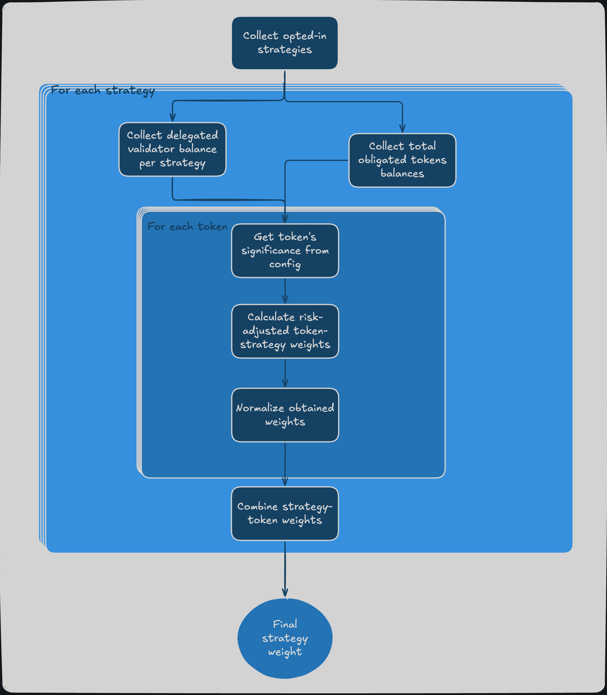

# Based App Example


The example discussed in this page can be found at this repository:

<a href="https://github.com/ssvlabs/examples">
  
</a>

It has been built to execute one task: fetch the most recent block and reach a majority vote on the slot number.

The simple example implemented [here](https://github.com/ssvlabs/examples) and used as reference in this page does not currently use the SDK as it breaks down the steps further, with verbose logging, for illustrative purposes, as this is the most important thing that BApp client developers need to familiarize with.

When launched, the application the first action it takes is to fetch on-chain data for the given Based Application, in order to calculate the Strategy weights.

## Strategy Weights

In Based Applications, the **obligated token balance and delegated validator balance** are used to attribute a weight to each Strategy, which is then **used to vote** on whatever task the client should be accomplishing.

For an overview of these steps as well as a thorough explanation on the calculations, [please refer to this page in the Learn section](../learn/based-applications/strategy-weights.md).

Developers should, however, not worry too much about it, as all of this can be accomplished thanks to high-level SDK functions: [`getStrategyTokenWeights()`](./BA-SDK/module-reference/api-module.md#getstrategytokenweights) and [`calcArithmeticStrategyWeights()`](./BA-SDK/module-reference/utils-module.md#calcarithmeticstrategyweights) (as well as its other variants).

The vote calculation follows these steps:

1. Collect strategies opted-in to the bapp
2. Collect total validator balance delegated to all opted-in strategy owners
3. Collect total obligated token balances
4. Get "significance" of tokens and validator balance from config
5. Calculate risk-adjusted weights for each token, for each strategy
6. Normalize the obtained weights
7. Combine strategy-token weights into a final weight for each strategy



Here's an example of the result of these steps, referencing the output of the application:

```
             📊 Normalized Final Weights             
┌──────────┬────────────┬──────────────┬────────────┐
│ Strategy │ Raw Weight │ Norm. Weight │ Weight (%) │
├──────────┼────────────┼──────────────┼────────────┤
│    4     │    1.28e-2 │      1.35e-1 │     13.54% │
│    5     │    8.18e-2 │      8.65e-1 │     86.46% │
└──────────┴────────────┴──────────────┴────────────┘
```

## BApp task execution

Once the application has finalized the Strategy Weights, it then starts the execution of a simple task (providing the next block slot number). The task is effectively executed, but the interaction between two independent strategy is simulated, for simplicity.

1. Strategies retrieve the slot number. In real world scenario, multiple instances of a client would do this independently, whereas the example only does this once.

2. The first Strategy attempts to complete the task, signing and broadcasting the voted slot number.

3. The vote is processed, but the first Strategy only has 13.54% of the total weight, the majority is not reached, so it is not enough to complete the task.

4. The second Strategy attempts to complete the task, signing and broadcasting the voted slot number.

5. The vote is processed, and the second Strategy has 86.46% of the total weight, reaching the majority threshold.

6. Since 100% of the total weight has now voted, the task is verified as complete. The system acknowledges that the task is fully verified.

You can visualize the task execution flow using the chart in the picture below


Below is the output of the example application pertaining to the steps just described:

```
🚀 Simulate Blockchain Agreement Process for Slot 11059006
[🧍strategy 4]  📦 Handling new block with slot 11059006.
[🧍strategy 4]  📤 Broadcasting vote
[🧍strategy 4]  🗳️ Received vote from participant 4 with slot 11059006
[🧍strategy 4]  📄 Checking majority for slot 11059006
[🧍strategy 4]  🔢 Total weight: 13.54%. Decomposition: 13.54% (from P4)
[🧍strategy 4]  ❌ Majority not yet reached for slot: 11059006
[🧍strategy 5]  🗳️ Received vote from participant 4 with slot 11059006
[🧍strategy 5]  📄 Checking majority for slot 11059006
[🧍strategy 5]  🔢 Total weight: 13.54%. Decomposition: 13.54% (from P4)
[🧍strategy 5]  ❌ Majority not yet reached for slot: 11059006
[🧍strategy 5]  📦 Handling new block with slot 11059006.
[🧍strategy 5]  📤 Broadcasting vote
[🧍strategy 4]  🗳️ Received vote from participant 5 with slot 11059006
[🧍strategy 4]  📄 Checking majority for slot 11059006
[🧍strategy 4]  🔢 Total weight: 100.00%. Decomposition: 13.54% (from P4) + 86.46% (from P5)
[🧍strategy 4]  ✅ Majority found for slot: 11059006. Updating last decided slot.
[🧍strategy 5]  🗳️ Received vote from participant 5 with slot 11059006
[🧍strategy 5]  📄 Checking majority for slot 11059006
[🧍strategy 5]  🔢 Total weight: 100.00%. Decomposition: 13.54% (from P4) + 86.46% (from P5)
[🧍strategy 5]  ✅ Majority found for slot: 11059006. Updating last decided slot.
```
